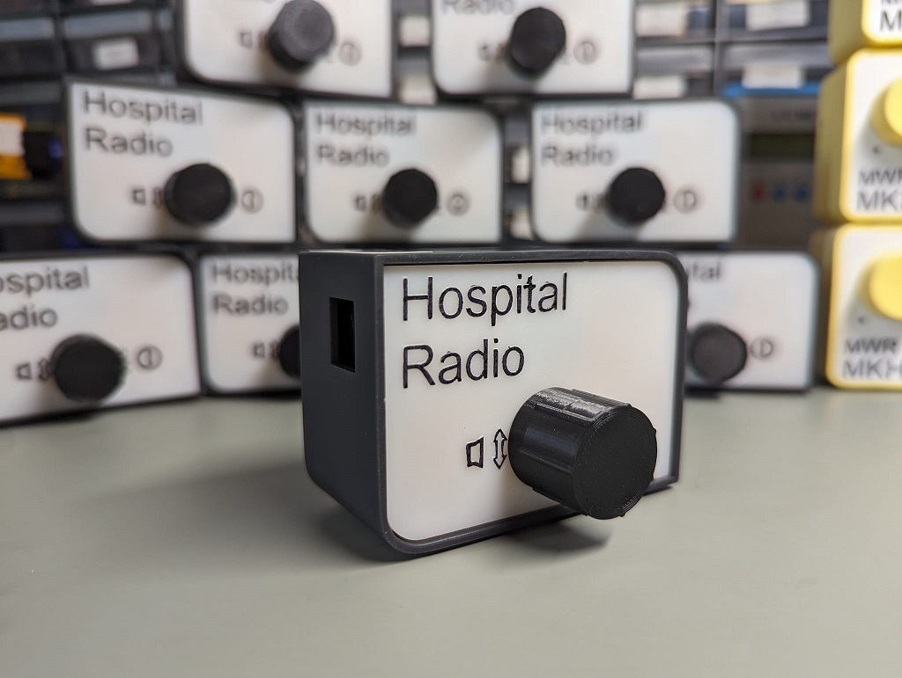
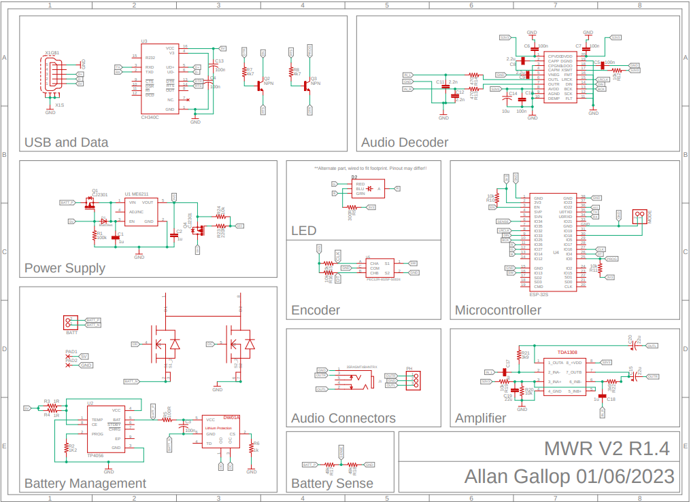
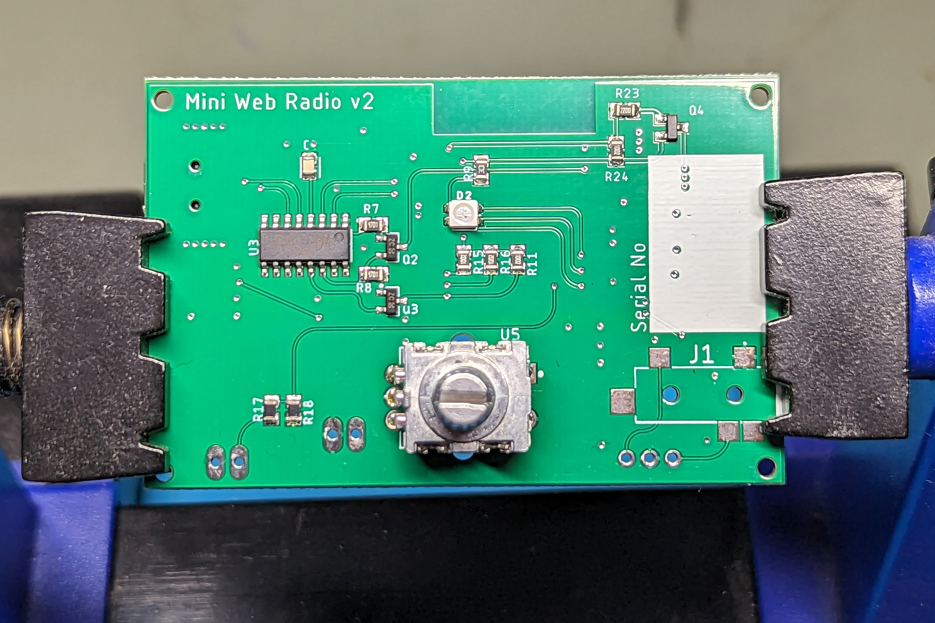
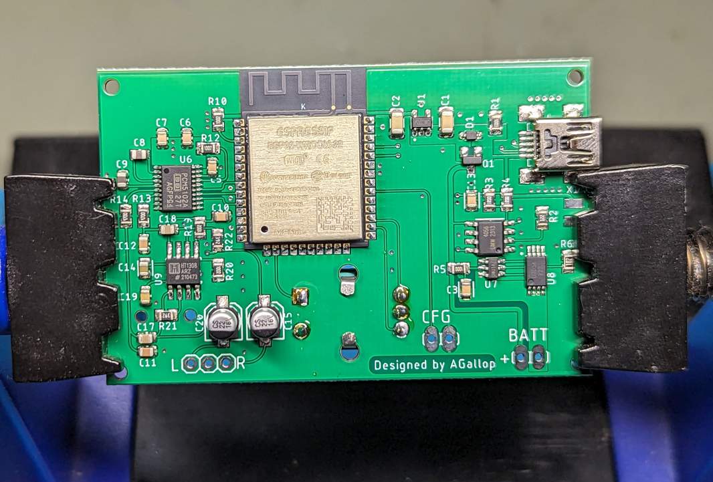
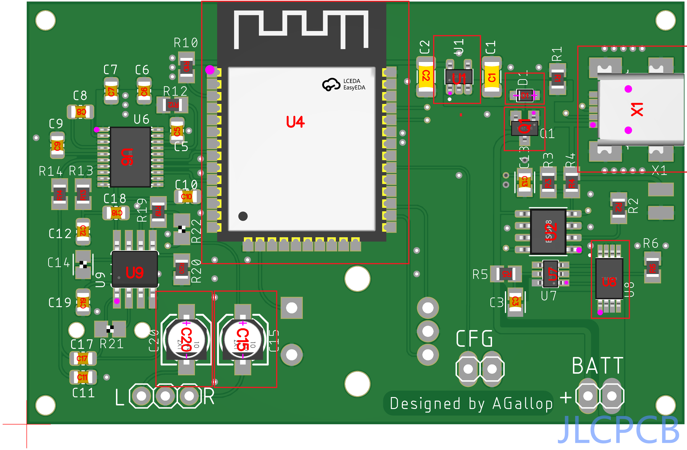
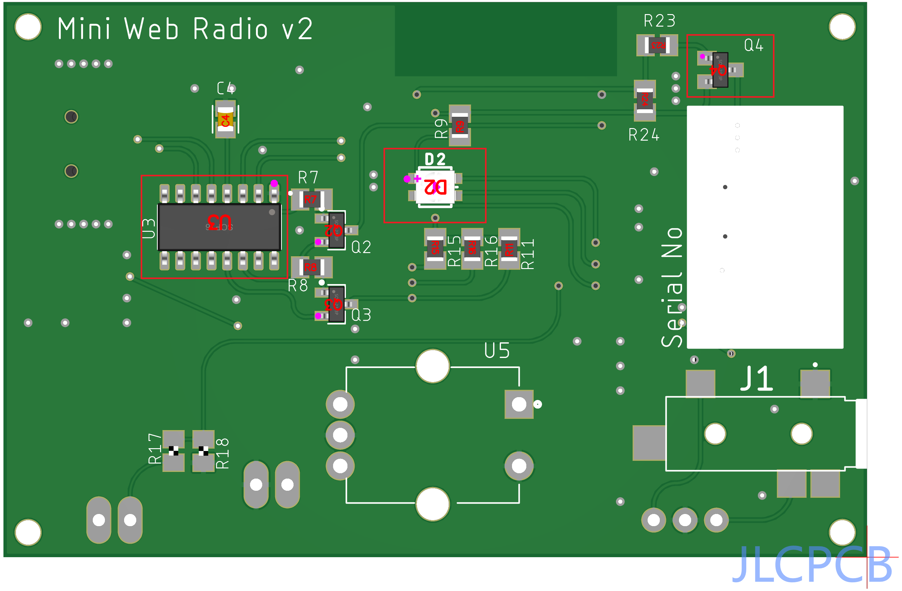
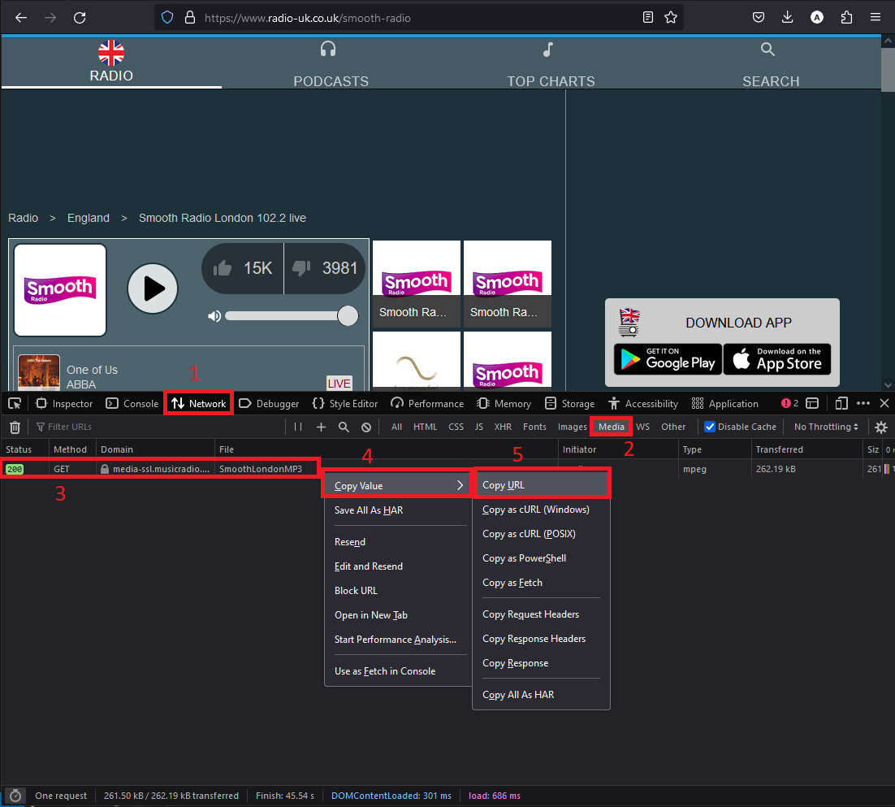

# Mini Web Radio 2

Originally designed as a charity project, the MWR is a simple internet radio based on the ESP32 microcontroller. Version 2 builds upon the [original project](https://github.com/AllanGallop/mini-web-radio) introducing stereo audio, supporting multiple channels and utilises a custom PCB with (mostly) surface mount components.

> Be warned, This project is still in the prototype phase

## Hardware

### Core hardware Components

* Expressif ESP32-S2 (or similar dual core variant)
* Texas Instruments PCM5102APWR audio stereo dac
* NXP TDA1308 Class AB Stereo headphone driver
* PEC12R - 12 mm Incremental Encoder
* TP4056 Lithium battery charger
* ME6211C33 500mA LDO regulator
* CH340C USB-UART

### Schematic

## Construction

### PCB

The PCB can be produced and assembled by a fabrication service such as JLCpcb, who are also able to source a marjority of the parts. Alternatively you can fabricate the PCB and acquire / assemble it yourself. Regardless of which method chosen you will need to solder on the through-hole components yourself.. fortuently this is just the rotatry encoder and the pin headers so only minimal soldering skills are required.

All construction files, including a BOM / CPL are provided in the [pcb](pcb/) directory. Additional parts needed to complete the build are maintained in a [seperate file](pcb/additional_parts.txt).

__Component Placement__

The JLCpcb assembly tool sometimes misaligns components (especially if a part is substituted). Use these images to confirm placements align with fiducial markers of the pcb. 

_Commonly misaligned are U1, D1, D2, Q1, X1, U2, U4, Q4, U8, C15 and C20_

### Case

The case is 3D printed, as above this can be done by a fabrication service if you do not own a printer. 

> Consider asking your local makerspace about 3D printing!

### Firmware

The firmware is provided in the [firmware](firmware/) directory. You will need [PlatformIO](https://platformio.org/) to build and upload it.

> Raise an issue if you would prefer an Arduino IDE version... or PR one yourself

## Operation

### Controls

The radio is designed to be easy to use, there is only one control!

* Push dial to switch it on
* Hold dial to switch it off
* Push dial while running to change channel
* Twist dial to change volume

### Status Light

| Colour | Description |
|:---|---:|
| Blue | Waiting for network |
| Green | Running - Battery Good |
| Amber | Running - Battery Reasonable |
| Red | Running - Battery Low |
| Off | Radio Off / Standby |

## Configuration

The MWR has built-in browser based configuration which allows you to define the Hostname, Wireless network credentials and the playback URL.

> Enable Configuration mode

1. Switch Off MWR
2. Open Faceplate 
3. Install jumper (2.54mm) or short config pins
4. Turn On MWR
5. Connect to `MWR-WIFI-SETUP` wireless network
6. Remove Jumper
6. Navigate browser to `192.168.1.1`
7. Enter configuration Details and select `Save`
8. The MWR will automatically restart into radio mode and begin playback

> **Use SPIFF Files**   Alternatively you can enter configuration details directly into the configuration files (host, ssid, pass, url) located in the _data_ directory, this is preferred when mulitiple units require setup. 

### Multiple URL's
Multiple station URL's can be entered, there should be **one** url per line. The following streams are supported:

* MP3 / M3U
* M3U8
* AAC
* FLAC
* OPUS
* OGG

### Finding URL's
There are lists available online, such as this one, however if you are unable to locate the stream URL of a preferred station I suggest locating the website in which the stream can be listened from, opening your browsers dev tools (usually F12), selecting the _Network_ and finally filter the list be 'Media' types. You may need to reload the page and start/stop playback for it to show up.

